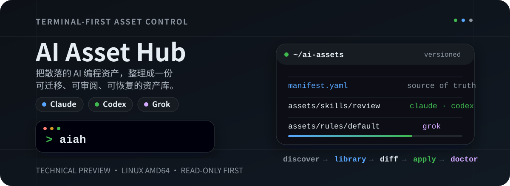
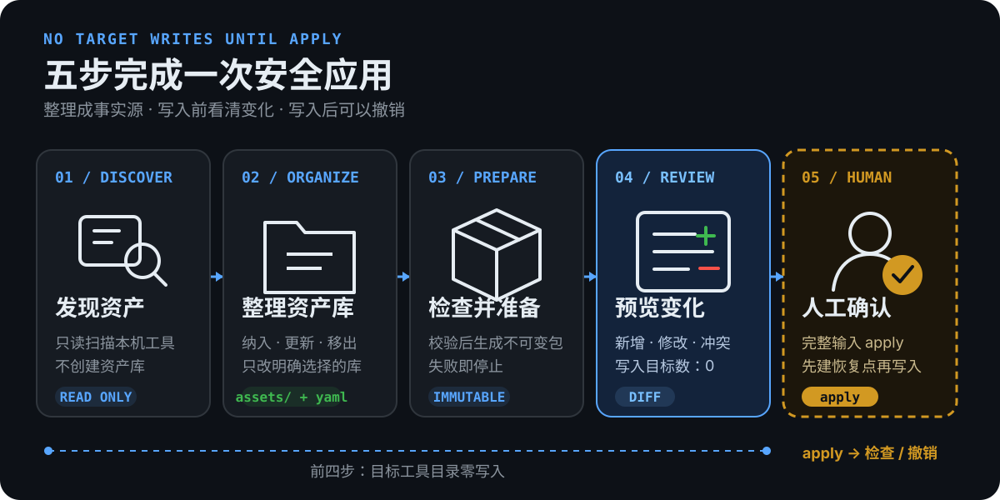
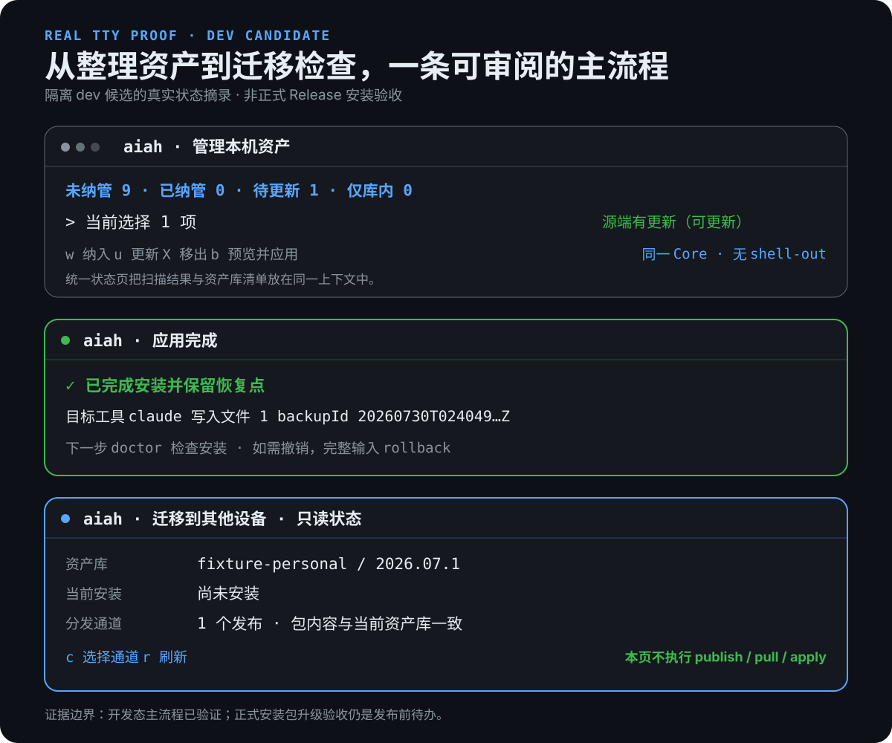

<p align="center">
  
</p>

<p align="center">
  <a href="https://github.com/dff652/ai-asset-hub/releases"></a>
  
  
  <a href="LICENSE"></a>
</p>

AI Asset Hub（`aiah`）是面向个人与小团队的 **AI 编程资产管理器**。它把分散在
Claude、Codex、Grok 中的 Skills、Rules、Memory、Agents、Hooks 与 MCP 模板整理成
一份可版本管理的资产库，并提供写入前预览、安装检查、撤销和跨设备迁移。

> **当前边界：Technical Preview。** 最新公开版是 `v0.1.5`，安装与端到端验收范围
> 为 **Linux amd64**。任务首页、统一资产状态、更新/移出向导、连续应用和只读迁移
> 状态已经完成正式 Release 安装包验收。

## 立即开始

Linux amd64 一行安装：

```bash
curl -fsSL https://raw.githubusercontent.com/dff652/ai-asset-hub/v0.1.5/scripts/install.sh |
  AIAH_VERSION=0.1.5 sh
aiah
```

`aiah ui` 作为兼容入口保留。安装器校验 Release SHA256 后原子替换到
`~/.local/bin`，不用 sudo，也不修改 shell profile；同版本复装零下载、零写入。
也可以固定安装目录：

```bash
curl -fsSL https://raw.githubusercontent.com/dff652/ai-asset-hub/v0.1.5/scripts/install.sh |
  AIAH_VERSION=0.1.5 AIAH_INSTALL_DIR="$HOME/.local/bin" sh
```

当前 `main` 安装器默认 pin 仍是已验收的 `v0.1.4`；它将与升级提示修复和回归一起
在后续 PR 收口。安装或升级到 `v0.1.5` 时必须像上面一样显式设置
`AIAH_VERSION=0.1.5`。aiah 不在后台升级。

先只读检查版本：

```bash
aiah update --check
```

它不会下载或替换二进制。已知问题：`v0.1.4` / `v0.1.5` 输出的推荐命令缺少
`AIAH_VERSION`，直接复制可能仍安装旧 pin；请使用上方显式版本命令。该问题已在
[`v0.1.5` Release](https://github.com/dff652/ai-asset-hub/releases/tag/v0.1.5)
标注，并列为下一版本 P0。`aiah --update` 和不带 `--check` 的 `aiah update`
都不会执行升级。

直接执行远程脚本前，推荐先下载、阅读再运行。Release 裸二进制的手动安装方法见
[上手指南](docs/getting-started.md#安装)。

Linux amd64 已完成端到端行为验证。`v0.1.1` 中现存的 macOS、Windows 和 arm64
文件是历史交叉编译产物，未做对应平台原生验收，不属于当前支持范围；后续 Release
只发布 Linux amd64，其他平台通过原生验收后再恢复分发。

## 第一次使用：五步安全应用

这张图只表达“第一次把资产安全应用到本机”的主流程，不是全部功能地图。

<p align="center">
  
</p>

只需要分清三个角色：

| 位置 | 角色 |
|---|---|
| `~/ai-assets/` | 可进入 Git 的资产库，也是唯一事实源 |
| `*.tar` | 从资产库生成的确定性、不可变安装包 |
| `~/.claude` / `~/.codex` / `~/.grok` | 目标工具目录，是可重建的安装结果 |

日常流程是：

```text
发现资产 → 整理资产库 → 检查并准备 → 预览变化 → 人工确认
```

前四步都不写 `.claude`、`.codex` 或 `.grok`；只有审阅变化后完整输入 `apply`
才会应用，并在写入前创建本机安装恢复点。随后运行安装检查，必要时可以撤销。
五步各自的输入、输出和写入边界见[上手指南](docs/getting-started.md#2-五步完成一次安全应用)。

其它常见流程：

| 你要做什么 | 简化流程 | 入口 |
|---|---|---|
| 日常维护 | 查看统一状态 → 更新/移出 → 预览 → 应用 | TUI |
| 检查与撤销 | 安装检查 → 判断漂移 → typed `rollback` | TUI / CLI |
| 跨设备迁移 | build/publish → 外部搬运 → pull → diff/apply | TUI 看状态，CLI 执行 |
| AI 与自动化 | MCP 只读查询，或 CLI JSON 编排 | `aiah mcp` / CLI |
| 升级 aiah | 只读检查 → 指定 Release → 校验并原子替换 | installer |

完整入口、写入边界和当前覆盖见[使用流程总览](docs/usage-flows.md)。

跨设备时，私有 Git/NAS 负责**资产库备份**，Git、NAS、U 盘等负责搬运不可变包；
`publish/pull` 不是双向同步，`.aiah/backups` 也只是本机**安装恢复点**。

## TUI：先看状态，再做操作

<p align="center">
  
</p>

> 上图所示任务首页、统一状态、更新/移出、连续应用和迁移状态页已用 `v0.1.5`
> 正式 Release 安装包完成隔离 TTY dogfood。

`v0.1.5` 把常用操作放在一个任务首页：

- **整理本机资产**：查看未纳管、已纳管、待更新、仅库内和不可纳管状态；
- **预览并应用资产库**：自动检查资产、准备安装包并展示变化，最终仍需输入
  `apply`；
- **安装检查与撤销**：显示包版本、目标工具、漂移和恢复点；
- **迁移到其他设备**：只读比较资产库、当前安装和用户选择的分发通道；
- **关于与更新**：默认离线，只有明确触发才检查 GitHub Release。

完整图解和首次操作见[上手指南](docs/getting-started.md)，TUI 产品用语与状态边界见
[产品体验方案](docs/designs/tui-product-experience-v2.md)。

## 人和 AI 都能使用

| 入口 | 用途 |
|---|---|
| TUI：`aiah` | 人工交互主入口；`aiah ui` 继续兼容 |
| `aiah scan` | 自动化或 JSON 方式盘点本机资产 |
| `aiah validate` / `aiah build` | 校验资产库并构建确定性资产包 |
| `aiah diff` / `apply` / `rollback` | 预览、应用和撤销 |
| `aiah publish` / `pull` / `versions` | 通过普通目录分发不可变资产包 |
| `aiah bootstrap` | pull 后进入强制交互 diff 与 typed `apply` |
| `aiah doctor` | 只读检查 journal、backup、deployment drift 与 MCP 前置状态 |
| `aiah update --check` | 用户触发的只读 Release 版本检查 |
| MCP：`aiah mcp` | 供 AI 工具调用的只读 `scan/validate/diff/doctor/version` |

MCP 当前不开放写操作，也尚未覆盖 TUI 已有的统一资产状态和迁移状态；这两项已进入
[后续计划](docs/roadmap.md)。完整参数见[命令参考](docs/cli-reference.md)，
跨设备操作见[迁移 runbook](docs/runbooks/cross-device-transfer.md)。

## 安全边界

- TUI 首页和本机资产页初始只读；只有明确选择并确认资产库后，才会创建或写资产库。
- 应用入口只来自显式 `--package`，或当前会话成功构建出的包。
- TUI 应用必须完整输入 `apply`；`bootstrap` 没有 `--yes` 或非交互旁路。
- TUI 撤销只针对安装检查识别到的当前安装，且必须完整输入 `rollback`；选择
  历史 backup 仍使用 CLI。
- MCP server 只暴露 `scan`、`validate`、`diff`、`doctor`、`version`，不暴露
  `build`、`apply` 或 `rollback`。
- MCP 原生配置采用 create-only 所有权；冲突时整单 fail-closed。
- 项目 `CLAUDE.md` / `AGENTS.md` 由项目 Git 管理；aiah 只盘点和报告，不自动对齐。

安全模型见[安全与隐私](docs/security.md)，漏洞报告见
[`SECURITY.md`](SECURITY.md)。

## 文档

- [上手指南](docs/getting-started.md)
- [使用流程总览](docs/usage-flows.md)
- [命令参考](docs/cli-reference.md)
- [文档总索引](docs/README.md)
- [总体架构](docs/architecture.md)
- [资产模型](docs/asset-model.md)
- [工程流程](docs/development.md)
- [MVP 路线图](docs/roadmap.md)

## 开发

项目采用 CLI-first、Go Core；TUI 复用同一个 Core，不复制业务规则。新设备先运行
`./scripts/dev-doctor.sh`，提交前运行 `./scripts/check-local.sh`。完整约束见
[工程流程](docs/development.md)和根 [`CLAUDE.md`](CLAUDE.md)。

## 许可证

本项目以 [Apache-2.0](LICENSE) 发布，版权署名见 [NOTICE](NOTICE)，第三方许可见
[第三方依赖许可证清单](docs/licenses/third-party.md)。
