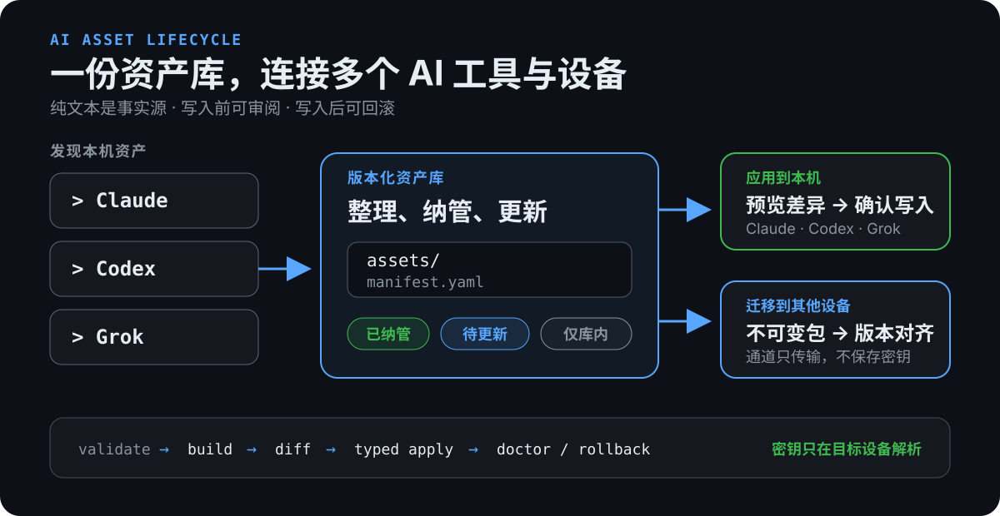

# 上手指南

这是完整的用户教程。日常本地使用优先走一条 TUI 主线；CLI 留给自动化、假 HOME
演练和跨设备分发。本指南从整理本机资产走到可审计、可撤销的首次应用。命令参数总表见
[使用流程总览](usage-flows.md)和[命令参考](cli-reference.md)；真实 HOME 的逐项检查见
[真机 dry-run runbook](runbooks/real-home-dry-run.md)。

## 安装

当前安装和 Release 支持范围为 **Linux amd64**。推荐先下载并阅读安装器：

```bash
curl -fsSLo /tmp/aiah-install.sh \
  https://raw.githubusercontent.com/dff652/ai-asset-hub/main/scripts/install.sh
less /tmp/aiah-install.sh
sh /tmp/aiah-install.sh
```

当前源码中的安装器默认 pin 是已经完成线上产物和正式 TUI 验收的 `0.1.5`。
要固定不可变 tag、安装目录或版本，显式设置：

```bash
curl -fsSLo /tmp/aiah-install-v0.1.5.sh \
  https://raw.githubusercontent.com/dff652/ai-asset-hub/v0.1.5/scripts/install.sh
AIAH_VERSION=0.1.5 AIAH_INSTALL_DIR="$HOME/.local/bin" \
  sh /tmp/aiah-install-v0.1.5.sh
```

从 [Release](https://github.com/dff652/ai-asset-hub/releases/tag/v0.1.5)
手动下载时，必须同时下载 `SHA256SUMS`。Linux amd64 示例：

```bash
sha256sum -c SHA256SUMS --ignore-missing
chmod +x aiah_0.1.5_linux_amd64
mkdir -p "$HOME/.local/bin"
install -m 0755 aiah_0.1.5_linux_amd64 "$HOME/.local/bin/aiah"
aiah version
```

安装器不会修改 PATH；命令找不到时把 `~/.local/bin` 加入 PATH。

### 升级

当前升级到 `v0.1.5` 使用显式版本命令：

```bash
curl -fsSL https://raw.githubusercontent.com/dff652/ai-asset-hub/v0.1.5/scripts/install.sh |
  AIAH_VERSION=0.1.5 sh
```

脚本不是不受控的“永远取 latest”：仓库中的默认版本只在对应 Release 产物和
`SHA256SUMS` 验证完成后更新。本机版本较旧时，安装器校验下载内容并原子替换
`~/.local/bin/aiah`；已经是同版本时零下载、零写入。固定版本、降级或重装指定版本：

```bash
curl -fsSL https://raw.githubusercontent.com/dff652/ai-asset-hub/main/scripts/install.sh |
  AIAH_VERSION=0.1.5 sh
```

aiah 没有后台自动更新器，升级始终是显式操作。升级后用 `aiah version` 核对版本。

升级前可只读检查：

```bash
aiah update --check
aiah update --check --output json
```

检查只在命令执行时请求 GitHub latest release 元数据，不下载、不替换当前二进制。
已知问题：`v0.1.4` / `v0.1.5` 生成的推荐命令虽然绑定精确 tag，却没有显式设置
`AIAH_VERSION`；直接复制可能停留在旧 pin。升级到 `v0.1.5` 请使用本节上方的显式
版本命令。Release 说明已标注；当前源码已修复未来构建的命令并增加精确字符串测试，
但已经发布的旧二进制不会改变。`aiah --update` 不存在；不带 `--check` 的
`aiah update` 也会拒绝执行。

`v0.1.1` 中现存的 macOS、Windows 和 arm64 文件是发布范围收口前生成的历史
交叉编译产物，未做对应平台原生验收。它们不是安装器或当前支持范围的一部分；
后续 Release 只发布 Linux amd64，其他平台通过原生验收后再恢复。

## 1. 资产库、包和目标目录

| 目录 | 角色 | 谁写 |
|---|---|---|
| **资产库** `~/ai-assets/` | 唯一事实源，纯文本 + `manifest.yaml`，建议进入 Git | 人或明确选择资产库后的 TUI |
| **包** `*.tar` | 不可变产物，带 manifest、lock 与 SHA256 | `aiah build` |
| **目标** `~/.claude` / `~/.codex` / `~/.grok` | 工具实际加载的位置 | `aiah apply` |

目标目录是产物，不是源头。建立资产库后，应修改资产库再重新预览和应用，而不是
继续直接编辑目标目录。

## 2. 五步完成一次安全应用

下面五步是本地使用的主流程。TUI 会把它们连续编排起来；CLI 仍保留同样的 Core
阶段，供自动化和高级场景使用。

<p align="center">
  
</p>

| 步骤 | 用户要做什么 | 得到什么 | 写入边界 |
|---|---|---|---|
| 1. **发现资产** | 只读扫描 Claude、Codex、Grok 与共享目录 | 可纳管资产和风险清单 | 不写资产库，不写工具目录 |
| 2. **整理资产库** | 纳入、更新或移出选中的资产 | `assets/` 与 `manifest.yaml` 中的可编辑事实源 | 只改明确选择的资产库；不改源端和工具目标 |
| 3. **检查并准备** | 选择资产组合；让 TUI 校验并准备安装包 | 校验结果和 `dist/` 中的不可变包 | 校验失败即停止；仍不写工具目标 |
| 4. **预览变化** | 审阅新增、修改、删除、冲突和目标路径 | 一份只读 diff | 工具目标写入数仍为 0 |
| 5. **人工确认** | 完整输入 `apply` | 当前安装、安装记录和本机恢复点 | 此时才原子写入目标；随后可检查或撤销 |

因此，日常用户不必先记住 `validate → build → diff → apply`。界面用“检查并准备”
解释内部阶段，用“预览变化”明确尚未写入，并把唯一的高风险动作留给人工确认。
安装检查和撤销不是新的业务阶段，而是第五步完成后的安全闭环。

跨设备时仍复用同一条主线：在原设备完成第 1–3 步，把不可变包发布到普通目录并用
Git、NAS、U 盘或 rsync 搬运；新设备取回后从第 4 步继续，仍需预览并输入 `apply`。
这叫**分发与迁移**，不是后台双向同步；可编辑资产库应另用私有 Git、NAS 快照或
备份工具保留历史。

### 2.1 推荐：一个 TUI 完成本地流程

```bash
aiah
```

真实交互终端会打开任务首页。`aiah ui` 与 `aiah` 等价，作为兼容入口保留。
普通用户只需记住 `aiah`；带 `--package`、`--workspace`、`--home` 等高级直达参数
时继续使用 `aiah ui ...`。

首次使用选择 **整理本机资产**：

1. 明确输入要打开或创建的资产库，例如 `~/ai-assets`，回车确认；
2. 浏览“本机 AI 资产”，空格勾选要统一管理的项目；
3. 按 `w` **加入资产库**：复制资产并登记进 `manifest.yaml`；
4. 按 `b` **预览并应用**：选择资产组合，TUI 自动检查并准备安装包；
5. 审阅只读变更预览；按 `a` 只打开确认页，完整输入 `apply` 才写目标目录；
6. 完成后按 `h` 运行**安装检查**；满足条件时按 `x` 并输入 `rollback`
   可撤销上次安装。

没有确认资产库前，TUI 不显示复选框，也不会创建目录；它没有隐藏的默认资产库。
也可以在启动时显式传入 `--workspace ~/ai-assets`。HOME/project 下的 `.agents`、
`.claude`、`.codex`、`.grok` 及其子目录不能作为资产库。底层 build、diff 和 apply 都
调用与 CLI 相同的 Core，不另做一套规则。

当前 TUI 覆盖日常单机流程：整理资产、加入资产库、预览并应用、安装检查，以及
撤销上次安装。以下高级场景仍使用 CLI：

- aiah 程序自身的安装、升级和版本固定（TUI 只展示版本与安全命令）；
- publish / pull / versions / bootstrap 和跨设备传输；
- 选择并回滚某个历史 backup；
- JSON 自动化、CI、假 HOME 批量演练和 MCP server；
- secret provider 环境准备，以及直接编辑资产正文或 manifest 的高级字段。

TUI 是资产管理操作台；可审计的 `manifest.yaml` 仍是资产业务配置的事实源。
非 TTY 环境应使用 JSON 命令。

### 2.2 TUI 里的资产库与操作流程

资产库不是当前 shell 的目录，也不是 `.claude`、`.codex` 或 `.grok` 这样的工具
安装目录。它是由用户明确选择的、跨工具统一管理的可编辑事实源：

```text
资产库 /home/user/ai-assets
├── assets/          # 可编辑资产正文
├── manifest.yaml    # 资产、profile、targets 与应用属性
└── dist/            # build 生成的不可变包
```

资产库不需要按 AI 工具拆成三份。同一份资产可在 `manifest.yaml` 里通过 `targets`
声明应用到 `claude`、`codex`、`grok` 中的一个或多个目标；adapter 在应用阶段负责
转换到各工具的实际目录和格式。

“本机 AI 资产”页展示的是扫描到的资产来源，不是文件管理器，因此不会把资产库
作为树节点。当前资产库会显示在页面上方；按 `m` 返回任务首页，按 `?` 查看帮助。

任务首页的“迁移到其他设备”当前提供只读版本对齐：读取资产库版本、当前受管安装，
并可按 `c` 选择一个已有的普通目录分发通道。它不会创建通道、联网、发布、取回或
应用文件；“版本不同”也不会被解释成某一方更新。

1. **管理资产库**：页面统一显示“未纳管 / 已纳管 / 源端有更新 / 仅在资产库”。
   空格勾选后，按 `w` 纳入、`u` 更新或 `X` 移出；更新和移出需分别输入
   `update` / `remove`。这些动作不写工具目标目录。
2. **连续预览**：纳入、更新或移出成功后，自动选择资产组合、检查资产并在
   `<资产库>/dist/` 准备安装包；也可随时按 `b` 单独开始。
3. **确认应用**：审阅变化，按 `a` 打开确认页；只有完整输入 `apply` 才写
   `.claude`、`.codex`、`.grok` 或 `.agents`，并生成安装恢复点和安装记录。

推荐用私有 Git 或 NAS 快照备份资产库；不要提交凭据，也不要把 `dist/` 或目标工具
目录当作资产源码。`update` 是一次显式的源端 → 资产库完整替换，不是后台双向同步；
`remove` 不删除源端文件。日常修改资产库后重新预览和应用。

这里的三个概念不要混用：

- **资产库备份**：保留可编辑事实源的历史并可独立恢复；当前由 Git/NAS/备份工具负责。
- **安装恢复点**：apply 覆盖目标文件前保存的本机材料，只用于 `rollback`。
- **跨设备分发**：发布、搬运和取回不可变包；不做双向同步或冲突合并。

盘点结果中的 `candidate` 只是迁移候选，不代表应原样打包。凭据、session、cache、
数据库和疑似 secret 会被排除或脱敏报告。

## 3. CLI：只读盘点与建立资产库

需要脚本化时：

```bash
aiah scan --home "$HOME" --output json > /tmp/aiah-scan.json
aiah ui --home "$HOME" --workspace ~/ai-assets
```

`scan` 不写 HOME/project、不执行 hook，也不跟随逃逸软链接。TUI 把选中资产复制进
资产库并登记到 `manifest.yaml`；已有文件 create-only，不覆盖。校验失败会回滚
本次创建的文件和目录。

资产库布局与 manifest 字段见[资产模型](asset-model.md)。可以手工整理，也可以显式
让 TUI 组装。

每条资产的四个属性决定后续行为：

- `targets`：部署到哪些工具；
- `scope`：`global` 写 HOME、`project` 写项目根、`device` 永不 apply；
- `portability`：原样分发或需要 adapter；
- `sensitivity`：敏感 MCP env 只允许 `${ENV:...}` / `${secret:...}` 引用。

项目自己的 `CLAUDE.md` / `AGENTS.md` 由项目 Git 管理。aiah 会盘点 missing 或
shadowing，但不会替项目自动初始化、复制、删除或改名。完整边界见
[资产模型 §4.1](asset-model.md#41-claudemd-与-agentsmd-的处理)。

### “导入”与“导出”分别指什么

- **已有工具目录 → 可编辑资产库**：支持。在 TUI 盘点后勾选资产并选择
  “加入资产库”；CLI/Core 对应 `scan` + `compose`。
- **可编辑资产库 → 不可变包**：支持。界面称“准备安装包”或“生成分发包”；
  CLI 命令是 `build`。
- **不可变包 → Claude/Codex/Grok 目标目录**：支持。通过
  `pull` / `bootstrap` / `diff` / `apply` 预览并应用。
- **不可变包 → 可编辑资产库**：当前不支持。包是安装产物，不是源码恢复格式；
  要继续维护资产，应迁移或恢复原资产库（例如 Git、NAS 或 U 盘），而不是反向
  解包重建。

## 4. CLI：校验并构建

```bash
aiah validate --manifest ~/ai-assets/manifest.yaml --output json
aiah build --manifest ~/ai-assets/manifest.yaml --profile personal \
  --out /tmp/aiah-dist --output json
```

`validate` 只读检查 schema、依赖/冲突、路径逃逸、软链接、疑似密钥、二进制和超大
文件。`build` 复用同一套检查，按 profile 选择资产，并原子写出：

```text
<name>-<version>-<profile>.tar
<name>-<version>-<profile>.manifest.json
<name>-<version>-<profile>.lock.json
<name>-<version>-<profile>.sha256
```

相同输入应得到相同 archive 字节与 digest。构建不修改源工作区，也不写工具目录。

## 5. 可选但推荐：先走假 HOME 闭环

不要拿真实 HOME 做第一次全写测试：

```bash
WORK="$(mktemp -d)"
PKG=/tmp/aiah-dist/<name>-<version>-personal.tar

aiah apply --package "$PKG" --home "$WORK/home" \
  --project "$WORK/project" --output json
aiah scan --home "$WORK/home" --project "$WORK/project" --output json
aiah doctor --home "$WORK/home" --project "$WORK/project" --output json
aiah rollback --home "$WORK/home" --project "$WORK/project" --output json
```

也可以对仓库 fixture 运行：

```bash
./scripts/demo-apply-scan-loop.sh
./scripts/demo-apply-scan-loop.sh workspace-2b
```

验收目标是 apply 成功、再次 apply 幂等、doctor 无错误、rollback 后回到原状。

## 6. CLI：真机先 diff，再 apply

```bash
aiah diff --package "$PKG" --home "$HOME" --output json
aiah apply --dry-run --package "$PKG" --home "$HOME" --output json
aiah apply --package "$PKG" --home "$HOME" --output json
aiah doctor --home "$HOME" --output json
```

确认 dry-run 报告 `dryRun=true`、`ok=true` 且没有 error finding。真实 apply 会返回
`backupId`；记录它，出现问题时执行：

```bash
aiah rollback --home "$HOME" --backup <id> --output json
```

也可以在 TUI 审阅部署：

```bash
aiah ui --package "$PKG" --home "$HOME" --targets claude,codex
```

按 `a` 只进入第二次确认；必须完整输入 `apply` 并回车才会写入。成功后界面展示
`backupId` 和完整 rollback 命令。

## 7. 三个常见边界

- Hook 必须带 shebang；aiah 只落盘，不执行也不替目标工具 trust。
- MCP 原生配置是 create-only；已有同名 server 内容冲突会令整单 fail-closed。
- `.aiah/backups` 含设备恢复材料，不应提交 Git 或同步到不可信云盘。

更多排障见[踩坑清单](troubleshooting/ai-asset-pitfalls.md)。

## 8. 跨设备

先 build，再 publish 到普通目录；用 U 盘、Git、rsync 或挂载盘搬运；新设备 pull
后重复假 HOME、diff、apply 流程。aiah 不负责网络传输。

<p align="center">
  
</p>

完整命令、不可变规则与故障处理见
[跨设备迁移 runbook](runbooks/cross-device-transfer.md)。
